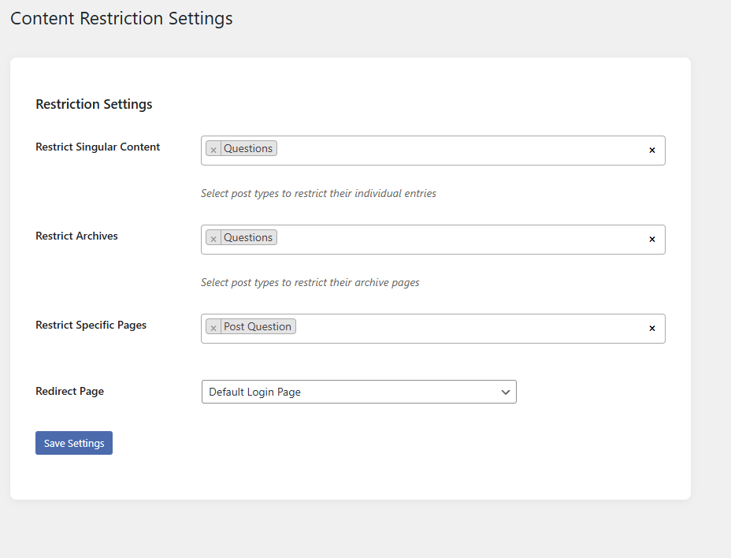

# Advanced Content Restrictor

**Contributors:** kaisercrazy \
**Tags:** content,restrictor,tools,dashboard \
**Donate link:** https://paypal.me/serkanalgur \
**Requires at least:** 5.6 \
**Tested up to:** 6.7.1 \
**Requires PHP:** 7.4 \
**License:** GPLv2 or later \
**License URI:** http://www.gnu.org/licenses/gpl-2.0.html

Control content access with precision. Restrict posts, archives, and pages. Custom login redirects. Modern dashboard interface. Must-use plugin.

## Description

**Advanced Content Restrictor**

Safeguard your WordPress content with surgical precision. This must-use plugin empowers administrators to protect sensitive material while maintaining a seamless user experience.

**Key Features:**
**🔒 Granular Content Control**

* Restrict individual posts/pages
* Protect entire post type archives
* Block custom post type singular entries
* Select multiple targets with smart filters

**🔄 Flexible Redirect Options**

* Choose any page as login redirect
* Default WordPress login fallback
* Maintains referral data for post-login returns

**🎛 Modern Administration**

* Intuitive Select2 multi-select interface
* Card-based settings layout
* Real-time selection previews
* Responsive dashboard design

**⚡ Optimized Performance**

* Must-use plugin architecture
* Zero database bloat
* Cached settings retrieval
* Lightweight (under 50KB)

**Use Cases:**

* Member-only content areas
* Premium resource protection
* Client portal restrictions
* Archive page paywalls
* Temporary content lockdown

**Technical Specifications:**

* Requires PHP 7.4+
* Compatible with WordPress 5.6+
* Follows WP coding standards
* Non-intrusive template redirects
* Full settings sanitization

**Why Choose This Plugin?**

* Unlike basic restriction plugins, our solution offers:
* Dual protection (singular + archives)
* Visual page selection interface
* No shortcode dependencies
* MU plugin reliability
* Future-proof settings architecture

**Setup in Minutes:**

* Install as must-use plugin
* Visit Settings → Content Restrictor
* Select protected content
* Choose redirect page
* Save and enjoy peace of mind

Maintain complete content control without compromising site performance or user experience. Ideal for agencies, membership sites, and enterprise implementations.

## Installation

1. Upload `advanced-content-restrictor` folder to the `/wp-content/plugins/` directory
2. Activate the plugin through the `Plugins` menu in WordPress

## Screenshots

### 1. Plugin Page

## Changelog

First Release
